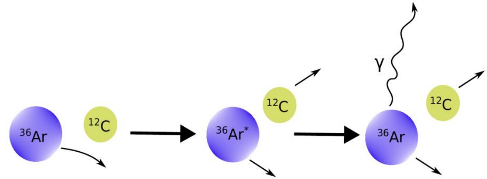
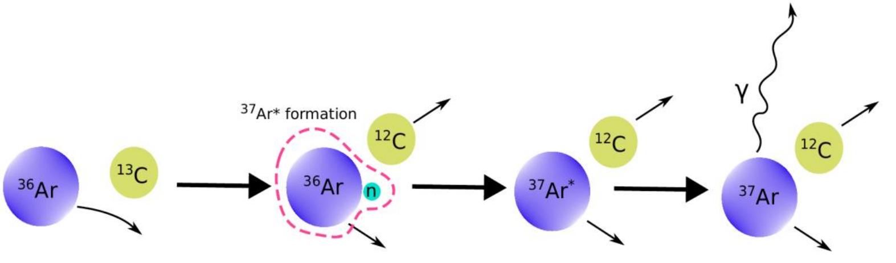
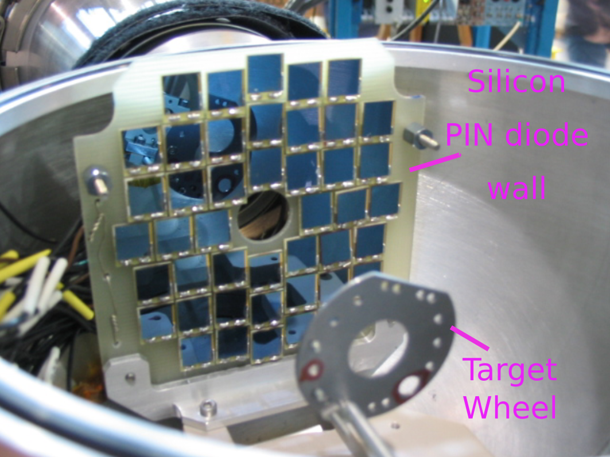
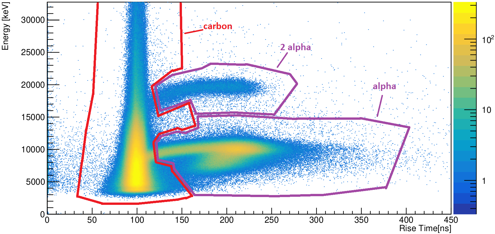

```{r setup, include=FALSE}
knitr::opts_chunk$set(echo = TRUE)
```

# Introduction

Nuclear science is greatly valued by society as it has brought many benefits such as
developing nuclear medicine and providing sustainable energy. To pursue nuclear technology, fundamental studies of the nucleus are essential.

Nuclear Physics is the study of the fundamental forces of nature and nuclear structure. The strong force is one of the fundamental interactions that binds quarks, which is a subatomic particle, into nucleons (protons or neutrons). The residual strong force, also known as the nuclear force, binds nucleons into nuclei. However, it has been a challenge to describe and predict fundamental nuclear properties, such as energies and transition rates between nuclear states by the nuclear force. The nuclear transition rate between two energy levels is proportional to a specific nuclear matrix element, which contains the information of the nuclear wavefunction. For example, for the electromagnetic transition of an excited argon-36 (from $2^{+}_1$ level to $0_{g.s}^{+}$ level), its transition rate, $\tau$ can be expressed as:

$$\tau_{2^{+}_1 \rightarrow 0^{+}_{g.s}}=\frac{1}{T_{2^{+}_1 \rightarrow 0^{+}_{g.s}}} \propto \omega^{5}B(E2; 2^{+}_1 \rightarrow 0^{+}_{g.s})$$

where $T_{2^{+}_1 \rightarrow 0^{+}_{g.s}}$ is the excited argon-36's lifetime at $2^{+}_1$ level, $\omega$ is the angular frequency of the $\gamma$-ray emitted during the transition, and $B(E2; 2^{+}_1 \rightarrow 0^{+}_{g.s})$ represents the reduced matrix element that contains information of the excited argon-36 nuclear wavefunction.

Once the general solution of the nuclear wavefunction for all nuclei is solved, all nuclear properties of all nuclei is unlocked and can be understood fully. This is the ultimate goal of Nuclear Physics.

Nuclear models that aim to accurately describe properties of all nuclei have been built on the nuclear shell model. The nuclear shell model is a framework and analogous to the atomic shell model, but accounts for differences in the radial potential and the fact that protons and neutrons are distinct fermions. It assumes nucleons are placed in discrete energy shells to provide insight on nuclear structure, where shell occupancy defines nuclear properties. Fully occupied shells with specific nucleon numbers leads to formation of magic or doubly magic nuclei; and the systematic errors in shell model calculations are minimal at the closed shells. Currently, no predictive nuclear model is found to be complete.

In order to gain insight on building an accurate nuclear model, experiments, which involve interactions between different particles and lead to different nuclear reactions, have been performed and data of the reactions were recorded. A typical experiment in Nuclear science involves argon-36 and argon-37, which are the isotopes close to the doubly magic calcium-40 isotope. At TRIUMF, an experiment was done to study argon-36 by using the TRIUMF-ISAC Gamma-Ray Escape Suppressed Spectrometer (TIGRESS), and the TIGRESS Integrated Plunger (TIP) device that was developed by Simon Fraser University (SFU). They were used to measure electromagnetic transition rates and thus the lifetime of excited states in argon-36 by performing a low-energy Coulomb excitation experiment. An argon-36 beam was delivered to a carbon-12 target with gold-197 backing. This target was carefully designed and engineered to extract excited nuclear states' lifetimes on the order of femtoseconds to picoseconds. Since 1% of the carbon atoms in the target are carbon-13, an additional reaction mechanism, which is a neutron transfer process from carbon-13 to argon-36, occurred with production of an excited argon-37 and carbon-12. The reactions of interest are shown below:

```{r image_36, include = TRUE, echo = FALSE, out.width='60%', out.height='60%', fig.align = 'center'}

```

```{r image_37, include = TRUE, echo = FALSE, out.width='80%', out.height='80%', fig.align = 'center'}

```

As shown above, within a single experiment, both argon-36 and argon-37 reactions can occur and lead to the same end products: a $\gamma$-ray and a carbon-12 particle. The $\gamma$-ray and the particle are detected by TIGRESS and TIP, respectively. Information of all types of end product ($\gamma$-ray and all particles) are then recorded in the TIGRESS data acquisition system. From the data, $\gamma$-ray and particle spectra can be extracted separately.

In order to extract the transition rate, the Monte Carlo method is used to perform simulations in the GEANT 4 framework, with known physics and experimental parameters inserted. Simulated $\gamma$-ray and particle spectra will be generated; and $\chi^{2}$ tests will be performed for comparison between experimental and simulation result. Subsequently, the best-fit lifetimes in excited argon-36 and argon-37 will be obtained. As a result, any predictive nuclear model can be tested by comparing its lifetime prediction with the extraction result.

# Potential Problems and Challenges

During the experiment, TIGRESS Integrated Plunger (TIP), which is a detection chamber, is used for detecting charged particle created in the nuclear reactions. This detection chamber consists of a target wheel for holding the carbon-12 target, and a wall of 44 PIN diodes for the particle detection. Below shows the PIN diode wall inside the chamber:

```{r TIP, include = TRUE, echo = FALSE, out.width='60%', out.height='60%', fig.align = 'center'}

```

In fact, when the projectile (argon-36 beam) interacts with the carbon target, at least four nuclear reactions (argon-36 and argon-37 reactions are two of them) occur. Therefore, four types of particles are detected and classified: carbon-12, alpha, double alphas and other particles. They are the end products from different nuclear reactions. Therefore, it is important to extract the information of reactions of interest via classifying and separating those particles.

Two detection parameters are used to identify the particles: **the particle's calibrated energy and the detection rise-time of the PIN diode**. The calibrated energy is the kinetic energy amount detected when the particle hits one of the 44 PIN diodes; and the detection rise-time represents the signal triggering time of the PIN diode. **Different types of particle has different mean calibrated energy and mean detection rise-time**. These two parameters are used to identify the particle types immediately via an online algorithm. Below is a 2-D histogram shows the particle identification (PID) for the argon-36 experiment:

```{r sumECal, include = TRUE, echo = FALSE, out.width='100%', out.height='100%'}

```

There are 3 hit event clusters shown in the plot: carbon-12, alpha and double alphas hit events. All other events outside of the clusters are classified as "other particles".

Currently the online algorithm is built by manually defining an energy range for every detection rise-time value. It checks every hit event the PIN diode detected and classified them according to the range defined in real time. This algorithm building procedure is specific for every experiment.

However, there has been a challenge to identify the particles if one cluster are very close to, or overlapping other clusters. Misclassification could be occurred if the ranges of calibrated energy and detection rise-time are defined manually. Also, "lost" events, which have the parameters but not identified in the online algorithm, were found in the data due to the sample rate of the data acquisition system is not high enough. Therefore, classification in machine learning could be useful for such an event recovering task.

# Statistical Methods and Implementation

As we can see from the above plot, the boundary of each cluster is not linear. Therefore, in this project, quadratic discriminant analysis (QDA) and random forest (RF) are chosen to perform classification and compare their performance.

```{r prep, include=FALSE, echo = FALSE}
library(MASS)
library(pROC)
library(nnet)
library(car)
library(glmnet)
library(randomForest)
library(dplyr)
library(corrplot)
library(FNN)

options(max.print=30)
part <- read.csv("PID.csv", sep=",")
part$labels <- factor(part$labels)
n=nrow(part)
```

First, let's look at the dimension of the full data set and the data structure. There are three columns: tr, amp and labels. "tr" is the detection rise-time (in nanoseconds), "amp" represents the calibrated energy (in keV) detected; and "labels" are the response variable shows the particle type of the hit event. Here is the dimension of the full data set and its first 10 entries:

```{r prep1, include=TRUE, echo = TRUE}
dim(part)
part
```

And we can see the amount for each particle type:

```{r prep2, include=TRUE, echo = TRUE}
summary(part)
```

```{r split1, include = FALSE, echo = FALSE}
options(max.print=100)
set.seed(46685326, kind ="Mersenne-Twister")
```

Please note that it takes a few minutes for training since the data set is quite large. It is enough to use 80% of the data for training:

```{r split2, include = TRUE, echo = TRUE}
perm <- sample(x = nrow(part))
ps1 <- part[which(perm <= 8* nrow(part)/10), ]
ps2 <- part[which(perm > 8* nrow(part)/10), ]
```

Now we apply Quadratic Discriminant Analysis (QDA) and Random Forest (RF) for training:

```{r pre0, echo = TRUE}
qda.fit.pj3 <- qda(data = ps1, labels ~ .)
pro.rf.pj3 <- randomForest(data = ps1, labels ~ ., importance = TRUE, ntree = 1000,
keep.forest = TRUE)
```

Note that for the setting of the random forest, we would like to access the importance of predictive variables and save the forest for any further analysis. Also, we used 1000 decision trees for the random forest.

# Result

First of all, let's have a glance on the training result. For QDA:

```{r QDA1, include = TRUE, echo = TRUE}
qda.fit.pj3
```

As expected, carbon detection is the largest portion of hit events (as indicated in the 2-D histogram), followed by alpha detection. For Random Forest:

```{r RF1, include = TRUE, echo = TRUE}
pro.rf.pj3
```

Although we can't see the performance of the QDA at the moment, we can already see the random forest's classification error is low for predicting carbon-12. Now, for each training and test data, we use the model to make prediction on each set (for both QDA and RF):

```{r er0, echo = TRUE}
qda.pred.train.pj3 <- predict(qda.fit.pj3, newdata = ps1)$class
qda.pred.test.pj3 <- predict(qda.fit.pj3, newdata = ps2)$class
pro.rf.train.pj3 <- predict(pro.rf.pj3, newdata = ps1)
pro.rf.test.pj3 <- predict(pro.rf.pj3, newdata = ps2)
```

To see the models' performance, first we look at the training error and it seems that the error of RF is less than that of QDA. This is within our expectation since RF usually handles large data set well, in general. Also, the above 2-D histogram shows that the relationship between features may be more complex than a quadratic decision boundary can handle. Below are the training errors for both QDA and RF:

```{r er1, include = TRUE, echo = TRUE}
(qmis.train.pj3<-mean(ifelse(qda.pred.train.pj3==ps1$labels, yes=0, no=1)))# QDA training error
(rfmis.train.pj3<-mean(ifelse(pro.rf.train.pj3==ps1$labels, yes=0, no=1)))# RF training error
```

We also calculate the test error to see the models' performance on the test data:

```{r er2, include = TRUE, echo = TRUE}
(qmis.test.pj3<-mean(ifelse(qda.pred.test.pj3==ps2$labels, yes=0, no=1)))# QDA test error
(rfmis.test.pj3<-mean(ifelse(pro.rf.test.pj3==ps2$labels, yes=0, no=1)))# RF test error
```

As we expect, the RF's test error is also less than QDA's test error. As per the case distribution between the prediction and true class, we look at the confusion matrix. For the QDA confusion matrix:

```{r QDA_cm, include = TRUE, echo = TRUE}
table(ps2$labels, qda.pred.test.pj3, dnn = c("Obs", "Pred"))
```

It seems that QDA sometimes may misclassify for "carbon" and "alpha". That is, the events predicted as "carbon" may actually be the "others", or predicted as "alpha" may actually be the "carbon" and "others". On the other hand, we also see such missclassifications in RF. Although we see there are misclassifications of RF for "others" (but they actually are other types), it does a better job than QDA in general:

```{r rf_cm, include = TRUE, echo = TRUE}
table(ps2$labels, pro.rf.test.pj3, dnn = c("Obs", "Pred"))
```

It is obvious that both QDA and RF performed well. For the Random Forest, we can also see the Out of Bag (OOB) error changes along with the number of trees used:

```{r rd_plt, include = TRUE, echo = FALSE, fig.width=8, fig.height=5.5, fig.align='center', fig.pos='H'}
plot(pro.rf.pj3, main = "RF OOB Error vs. Number of trees")
legend(x = "topright", legend = c("alpha", "2alphas", "carbon", "others"), lty = c(1, 2), col = c(1, 2, 3, 5), lwd = 2)
```

The plot suggests that for the lowest OOB errors, around 330 trees should be used. Also, the mean tree size histogram shows the distribution of the tree size, where the majority tree size is from 100 to 160:

```{r rd_plt1, include = TRUE, echo = FALSE, fig.width=8, fig.height=5, fig.align='center', fig.pos='H'}
hist(treesize(pro.rf.pj3))
```

We can further look at the relative importance of the variables:

```{r rd_plt2, include = TRUE, echo = FALSE, fig.width=8, fig.height=5, fig.align='center', fig.pos='H'}
varImpPlot(pro.rf.pj3, main = "RF Variable Importance Plots")
```

From the above plot, it is clear that the mean decrease in accuracy of "tr"(detection rise-time) is higher than that of "amp"(the calibrated energy of a hit event). This means that the model's accuracy drops larger if "tr" is excluded. Also, the mean decrease in Gini index of "tr" is larger as well, which means more effective and informative split, and better class separation in the node. Both plots indicate that "tr" is the most important variable.

# Conclusion

To conclude, classification in machine learning helps overcome the challenges of particle identification. Due to the non-linearity of the data, quadratic discriminant analysis (QDA) and random forest (RF) were chosen for this project. Both methods give out results which have less than 1% of test error:

```{r con, include = TRUE, echo = FALSE}
(errors <- data.frame(
  Method = c("QDA", "Random Forest"),
  Training_Error = c(qmis.train.pj3, rfmis.train.pj3),
  Test_Error = c(qmis.test.pj3, rfmis.test.pj3)))
```

In general, both methods work efficiently with high accuracy on large amount of data (98976 observations). RF performs better than QDA, and it shows that explanatory variable "tr" (detection rise-time) is relatively more important than "amp" (calibrated energy of a hit event).

Note that this experiment has only four types of particle; however, it is common that a Nuclear Physics experiments has more than 10 end product/particle types, which means more clusters to be analyzed and classified. This implies that the extent of overlapping for clusters will also become larger or more; and it is reasonable to expect that the misclassification rate will increase if more end products are involved in the data.

Therefore, an extension of this project would be using other data set which has higher overlapping area between different clusters, but keeping the number of particle type small.

With the help of classification in Machine Learning, "lost" events can be recovered and classified with high accuracy in general. This work will lead to a gain of higher statistics than current approach. With higher statistics in the experimental result, this will advance understanding of nuclear interactions needed to solve fundamental problems in nuclear science.